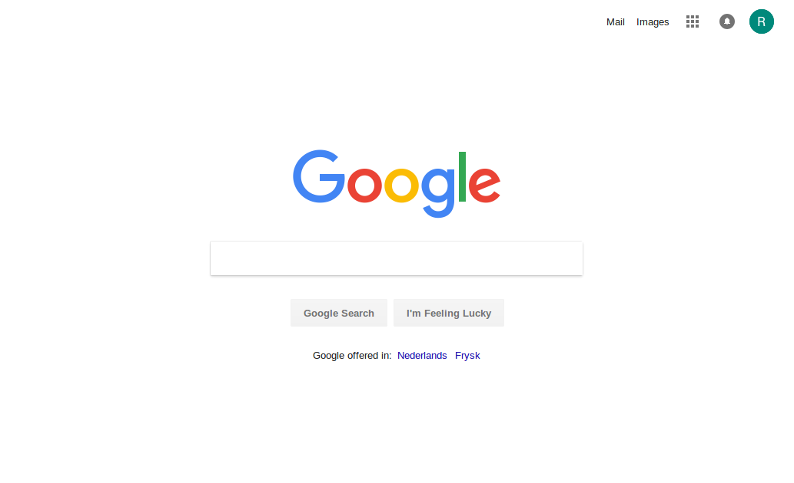
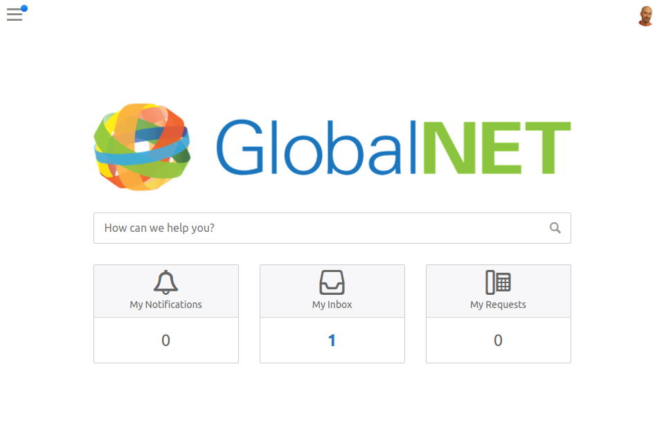
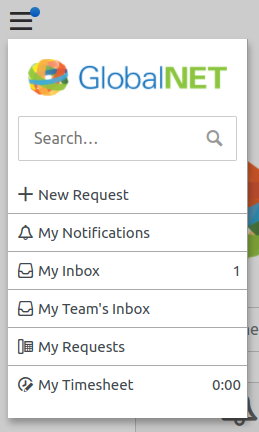
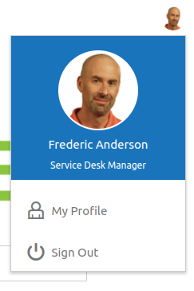
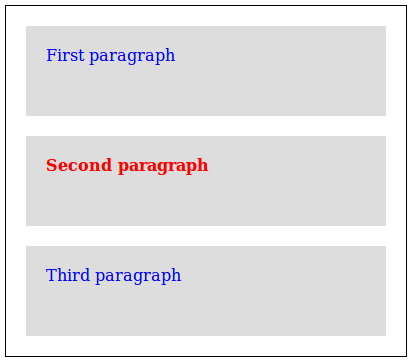

# 1. Introduction

GlobalNet decides to customize their Self Service design. After searching around for inspiration, they come across a nice and clean design that they would like to emulate:



They ask you to implement a design that has a similar look and feel.

You sketch out a few ideas and come up with the following:



The dropdown menu looks like this:



And when you click on the user picture on the right, it shows this:



The design is approved and you can start to implement it right away.

## What you will learn during this workshop

In this workshop, we will work through implementing the above design in 4me.

Along the way, you will learn about the tools that 4me makes available to customize the Self Service portal. 
In addition, we will touch on many aspects of implementing
a web page design in general. Among other things, you will learn:

* Which parts of the 4me Self Service portal can be customized
* How to implement common use cases in your Self Service design, such as creating a dropdown menu
* How to make use of the Bootstrap CSS framework to simplify the design task
* How to make the portal *responsive*, so that it looks good on all devices, both mobile and desktop
* How to use the Chrome Developer Tools

## Prerequisites

We assume that you have at least a passing familiarity with the terms `HTML` and `CSS`.

For example, given the following HTML fragment:

``` html
<div class="example">
  <p>First paragraph</p>
  <p class="special">Second paragraph</p>
  <p>Third paragraph</p>
</div>
```

and the following CSS rules:

``` css
.example {
  width: 400px;
  border: 1px solid black;
}

.example p {
  height: 50px;
  margin: 20px;
  padding: 20px;
  background: #ddd;
  color: blue;
}

p.special {
  font-weight: bold;
  color: red;
}
```

You should be able to guess approximately what the result will look like in your browser:




[Continue to the next chapter](2-self-service-design-fields.md). 
