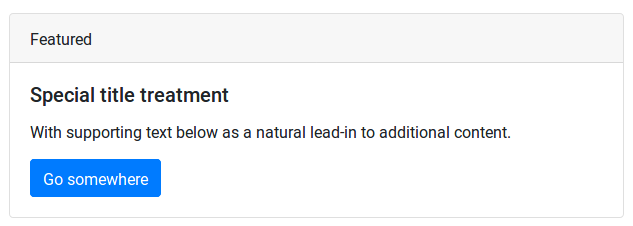
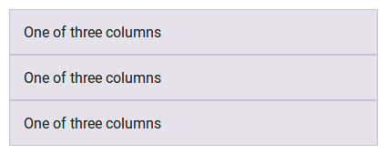

# 3. Bootstrap

As mentioned on the previous page, the [Bootstrap](https://getbootstrap.com/) framework 
is included on every Self Service page.

Bootstrap is a CSS framework that makes it easy to quickly build designs that look good on all devices (mobile and desktop).
See https://getbootstrap.com/docs/4.1/examples/ for some examples and screenshots.

It does this by offering out of the box styling tied to HTML classes.

Take for example the HTML below:

``` html
<div class="card">
  <div class="card-header">
    Featured
  </div>
  <div class="card-body">
    <h5 class="card-title">Special title treatment</h5>
    <p class="card-text">With supporting text below as a natural lead-in to additional content.</p>
    <a href="#" class="btn btn-primary">Go somewhere</a>
  </div>
</div>
```

Without any additional CSS styling, this HTML will be displayed as follows:



## Grid Layout

The most powerful feature offered by Bootstrap is its "responsive grid system". 
We will see this in action later, but as a quick example, consider the HTML below:

``` html
<div class="container">
  <div class="row">
    <div class="col-sm">
      One of three columns
    </div>
    <div class="col-sm">
      One of three columns
    </div>
    <div class="col-sm">
      One of three columns
    </div>
  </div>
</div>
```

On a desktop, this will show up as a single row with three columns next to each other:


The `col-sm` class signifies that the columns should only be displayed next to each other 
on devices that are 'small' (meaning 576px wide) or larger. 
On a 'very small' (i.e., mobile) device, the columns are stacked on top of each other:



As you can see on https://getbootstrap.com/docs/4.1/layout/grid/, the grid system offers a lot of possibilities.
We will make use of some of this in our design.

[Continue to the next chapter](4-centered-search-bar.md).
