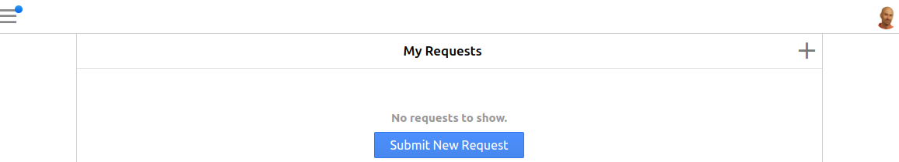
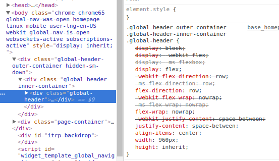

# 8. Navigation bar

The main content does not quite look like our design yet, but we have the basic layout in place now.

Before we continue to fill in the details, let's first switch our attention to a different part of the design: the navigation bar.

## What we want to achieve

The navigation bar and menu occur on each Self Service page.

By default the navigation bar looks like this:


We want to transform it to:



We will work on the following requirements:

* Show only the hamburger menu and the user menu, not the Search and Time spent today icons
* The hamburger menu should be all the way to the left, and the user menu all the way to the right
* The user avatar should be a circle
* The user menu should have a background color that matches the GlobalNet logo
* The hamburger menu should be a drop down menu

## Using the Chrome Developer Tools to experiment

The Developer Tools provided by the browser are very useful to try out modifications to a design, 
because you can immediately see the effect of your changes.
 
You can use the Developer Tools to find out how a piece of HTML is being styled by the browser, 
modify it until you are satisfied with the results, 
and then return to 4me to make the appropriate modifications in your Self Service Design.

Let us do this for some of the requirements above.

In Chrome, log in to GlobalNet as frederic.anderson@globalnet.com and go to https://globalnet.4me-demo.com/self-service/inbox.

Open the developer tools (Ctrl-Shift-I or Cmd+Option+I). Click on the icon for the Element Inspector:


Next, click somewhere in the middle of the navigation bar, so that the HTML element `div.global-header` is selected.

In the Elements panel, the corresponding element should now be selected and you should see which CSS properties apply to it:



Notice that this element is contained within a `div.global-header-inner-container`, 
which is itself contained within a `div.global-header-outer-container`.

**Exercise 8.1**

The width of the global header is by default restricted to 960px. 
Using the developer tools, can you remove this restriction and make the global header span the full width of the browser window?

[**View answer**](answers/answer-8.1.md)

**Exercise 8.2**

With the developer tools, you can also define new style rules, using the `+` icon.
Using this, can you hide the search and timesheet icons?

Hint: the `visibility` CSS property can be used for this, see https://developer.mozilla.org/en-US/docs/Web/CSS/visibility.

[**View answer**](answers/answer-8.2.md)

**Exercise 8.3**

Using the developer tools, change the background color of the navigation bar to white, 
and replace the shadow at the bottom with a border that is 1px wide and a slightly darker gray (`#ccc`). 
Finally, change the color of the hamburger menu icon to `#888`. 

[**View answer**](answers/answer-8.3.md)

**Exercise 8.4**

Still in the developer tools, can you adjust the small avatar, and the larger one that appears when you click on the small avatar, 
so that they are circular rather than rounded rectangles?

Hint: there is no need to define a new CSS property, you can achieve this by adjusting the existing CSS properties.

[**View answer**](answers/answer-8.4.md)

**Optional exercises**

If you like to practice some more with the developer tools, 
you can take [an optional detour](8a-more-developer-tools.md). 

## Save the results

Happy with the results of our experiments, we can now adjust the Self Service Design itself.

Go to the Self Service Design, and add the following to the `CSS` field:

``` css
body {
  background-color: white;
}

.global-header-outer-container {
  background: white;
  border-bottom: 1px solid #ccc;
  box-shadow: none;

  .hamburger-menu-toggler {
    color: #888;
  }

  .global-header-inner-container {
    max-width: 100%;

    .global-header {
      width: 100%;
    }
  }

  .widget-user-menu li#user-info {
    background: #1a74bc;
  }
}

.global_search_link.header-button {
  visibility: hidden;
}

.widget-time-spent-today.header-button {
  visibility: hidden;
}

.avatar_person {
  border-radius: 100% !important;
}

.page-container {
  box-shadow: none;
  border-left: 1px solid #ccc;
  border-right: 1px solid #ccc;
}
```

Save the design and check the results in the browser.

## A note on syntax: SCSS

You might notice that some of the rules are nested, like this:

``` css
.global-header-outer-container {
  ...
  
  .hamburger-menu-toggler {
    ...
  }
  
  .global-header-inner-container {
    ...
  }
}
```

This is very useful for showing which rules belong together, but it is not proper CSS.
The browser does not understand this, and needs the rules about the `.global-header-outer-container` 
to be written like this:

``` css
.global-header-outer-container {
  background: white;
  border-bottom: 1px solid #ccc;
  box-shadow: none;
}

.global-header-outer-container .hamburger-menu-toggle {
  color: #888;
}

.global-header-outer-container .global-header-inner-container {
  max-width: 100%;
}

.global-header-outer-container .global-header-inner-container .global-header {
  width: 100%;
}

.global-header-outer-container .widget-user-menu li#user-info {
  background: #1a74bc;
}
``` 

Because we feel that the latter is much harder to read and write than the former, 
all CSS fields in 4me may contain SCSS, which is a 'dialect' of CSS that adds some useful extensions to the language,
such as nesting and the use of variables (https://sass-lang.com/documentation/file.SASS_REFERENCE.html#css_extensions).

When you use SCSS syntax, it is translated to proper CSS before it is served to the browser.

## Add the navigation bar to the homepage

We want the navigation bar to be visible on the homepage as well. 
Since we started with a blank slate, we'll have to add it ourselves.

Add the following to the top of the Homepage HTML field:

``` html
<section class="header">
  <div class="global-header-outer-container">
    <div class="global-header-inner-container">
      <div class="global-header">
        <div class="left">
          {{hamburger_menu}}
        </div>
        
        <div class="right">
          {{user_menu}}
        </div>
      </div>
    </div>
  </div>
</section>

<nav class="global-navigation menu-slide">
  {{global_navigation_menu}}
</nav>
```

On the homepage, we don't want a border below the navigation bar, so also add the following to the Homepage CSS field:

``` css
.global-header-outer-container {
  border: none;
}
```

Save and check the homepage.

## Centering again

You might notice that something is not quite right anymore. 
Now that we have added the navigation bar, the main content is too high and a scroll bar is visible.

**Exercise 8.5**

Recall that we set the height of the main content to `100vh`.
 
Can you adjust it so that it takes the height of the navigation bar into account?

Hint: look up the height of the navigation bar using the developer tools.
Then use the `calc()` CSS function explained at https://developer.mozilla.org/en-US/docs/Web/CSS/calc
to express the desired height of the main content.

[**View answer**](answers/answer-8.5.md)

[Continue to the next chapter](9-dropdown-menu.md).
