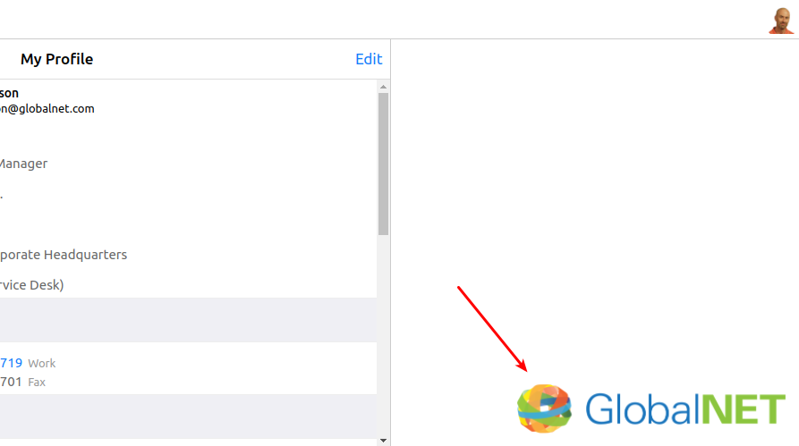

# 8a. More developer tools exercises 

**Exercise 8a.1**

While we are at it, we might as well adjust the rest of the page to the GlobalNet look and feel.

The page currently has a gray background. Change it to white.

The main content has a shadow effect. Remove that effect and replace it with a 1px `#ccc` border.

[**View answer**](answers/answer-8a.1.md)

**Exercise 8a.2**

It would be nice to add a small GlobalNet logo at the bottom right corner of the page:

Using one of the examples at https://www.w3schools.com/cssref/pr_background-position.asp,
 position the logo from the Media Library in the appropriate location.
 
Next, change the background size so that the logo is `300px` wide.

Finally, it looks better if the background is not quite pressed against the bottom right corner, but has some whitespace.
Using the `calc()` CSS function explained at https://developer.mozilla.org/en-US/docs/Web/CSS/calc, 
can you adjust the background position so that it is `16px` away from the bottom and `16px` away from the right?

[**View answer**](answers/answer-8a.2.md)

**Exercise 8a.3**

The user menu is still a dark blue. We would like to change it to the blue color of the GlobalNet logo.
Although we don't know the color, we can use the developer tools to find out.

Using the element inspector, find the element on which the dark blue color (gradient) is defined.
Change the `background` property to `blue`.

You will notice a small blue box next to the color:

Click on this box to open the color picker.

Next, hover the mouse over the final 'l' in the GlobalNet logo. You will see a close up of the individual pixels.
Click on one of the darkest blue pixels. You should see that the color of the user menu changes to that same color.

Click once more on the blue box to close the color picker.

[**View answer**](answers/answer-8a.3.md)

[Back to chapter 8](8-navigation-bar.md).
