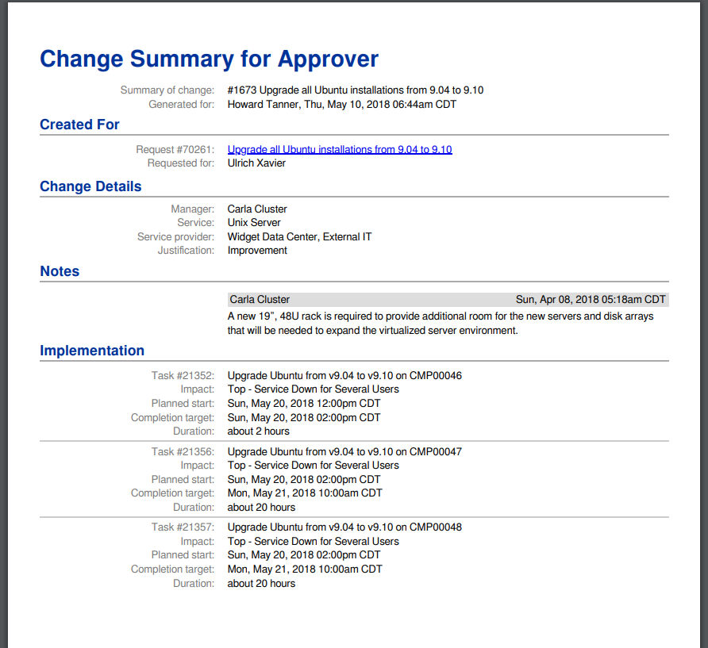

# 1. Introduction

When an approval task of a Change (or Project) is assigned to someone, 
that person receives an email notification from 4me. 
Attached to that email is a PDF containing a summary of the Change, 
on the basis of which the person can decide to approve or reject the task.

By default, the Change Summary PDF looks like this:

The default Change Summary may not always fit customer requirements. 
Some example requirements might be:

* By default, the Change Summary lists only some of the tasks of the Change. 
  I want to list *all* tasks instead (or a different subset).
* I want to show more information about each task, such as the affected Service Instances and/or Configuration Items.
* I want to adjust the labels, so they sound less technical (e.g. use "Subject" instead of "Summary of change").
* I want to change the look&feel of the Change Summary, so that it fits that of my company.
* I do not want to display the notes of the Change.
* For some Changes, I do not want to create a Change Summary PDF at all.

The PDF Designs functionality of 4me allows you to implement all these requirements. 

## What you will learn during this workshop

In this workshop we will take a deep dive into the customization possibilities offered by PDF Designs.

Among other things, you will learn:

* How to use JsRender to customize the contents of the Change Summary
* How you can CSS to design for the printed page
* How to define and use custom fonts in CSS
* How to use 'flexbox' to implement layouts

[Continue to the next chapter](2-how-it-works.md). 

