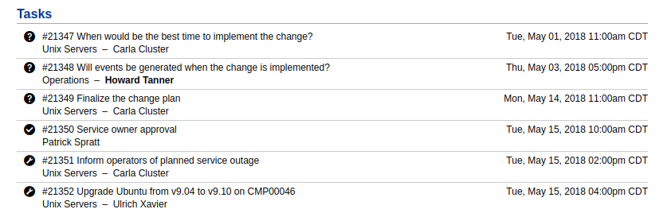
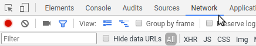
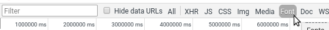
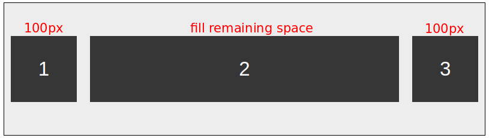
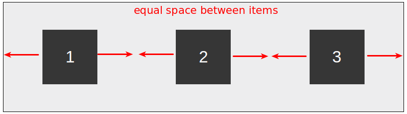
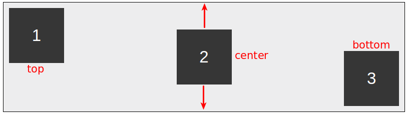
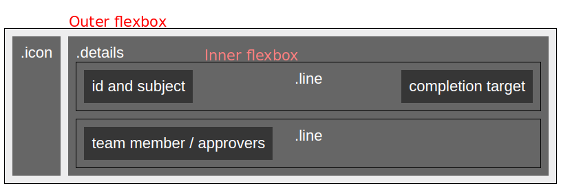

# 5. Task list

In this final step, we will improve the look&feel of the task list and make it look like this:



In the process, we will work through some CSS techniques 
that we haven't tackled during the Self Service Design part of the workshop. 

## Preparation

Create a new PDF Design of category Change Summary and give it a name.

Remove the Implementation section from the HTML field and replace it with the following:

``` html
<section>
  <h2>Tasks</h2>

  {{for change.tasks}}
  {{if status_key != 'canceled' && status_key != 'completed' && status_key != 'failed' && status_key != 'rejected' && status_key != 'approved'}}
  <div class="task with-divider">
    <div class="icon">
      <i class="ii icon-{{:category_key}}"></i>
    </div>

    <div class="details">
      <div class="line">
        <div class="left">
          <span class="id">{{:id}}</span>
          <span class="subject">{{:subject}}</span>
        </div>
        <div class="right">{{:to}}</div>
      </div>

      <div class="line">
        <div class="left">
          {{if category_key == 'approval'}}
          {{for approvals}}
          <div class="approver">
            {{if approver.id == ~root.recipient.id}}
            <strong>{{:approver.name}}</strong>
            {{else}}
            {{:approver.name}}
            {{/if}}
          </div>
          {{/for}}

          {{else}}

          <span class="team">{{:team.name}}</span>
          {{if member}}
          <span class="member with-hyphen">
            {{if member.id == ~root.recipient.id}}
            <strong>{{:member.name}}</strong>
            {{else}}
            {{:member.name}}
            {{/if}}
          </span>
          {{/if}}
          {{/if}}
        </div>
      </div>
    </div>
  </div>
  {{/if}}
  {{/for}}
</section>
```

## Borrowing the icon font

When creating the Self Service Design, we used the 4me icon font to [add icons to the homepage](../self-service/10-highlights.md).

In the screenshot at the top of this page, the icons that indicate the category of the task make use of this same font.

However, unlike the Self Service homepage, in which the 4me icon font was available out-of-the-box,
PDF Designs are truly a 'blank slate': apart from the CSS that you entered in the `CSS` field of the design,
there is *no* additional CSS injected when the PDF is generated. That means we have to define the font ourselves.

We'll do this in a few steps:

* Obtain the font file and upload it to the Media Library
* Define a `@font-face`
* Define CSS rules to render the correct glyph (character) of the icon font, given a HTML element with class `ii icon-<xyz>`

### Obtain the font file and upload it to the Media Library

Go to https://wdc.4me-demo.com/pdf_designs. Open the Chrome Developer Tools and click on the Network tab:



Now refresh the page. As you can see, the Network tab lists (among other things) all the resources that are requested when you load the page,
including the HTML of the page itself, images, CSS stylesheets, scripts and fonts.

In the filter toolbar, click on 'Font':



This filters the list of resources to display just the font files. 
In our case this shows exactly what we need: a single file that starts with `itrp-icons-...`.

Right-click on the name and choose 'Open in new tab'. The font file should now be downloaded.

Now go to the Media Library, create a new Media File with name "icon font" and upload the font file that you just downloaded.
Save the file and copy the public link URL. 

### Define a @font-face

To use the font in our PDF Design, we need to define a [`@font-face`](https://developer.mozilla.org/en-US/docs/Web/CSS/%40font-face)
in our CSS.

The `@font-face` is a special CSS rule that defines:

* The name of the font (its 'font-family')
* The URL of the font file.

Once the font is defined, we can refer to it by its name in the rest of the CSS.

**Exercise**

Define the `@font-face` in the `CSS` field, somewhere below the `@page` rule.

**Solution**

Add the following to the `CSS` field:

``` css
@font-face {
  font-family: "PDF Design Icons";
  src: url("<url to media file>");
}
```

### Define CSS rules to render the correct glyphs

As you can see in the HTML fragment at the top of the page, the icons are defined in the HTML as follows:

``` html
<i class="ii icon-{{:category_key}}"></i>
```

Depending on the task category, this will be rendered as one of these:

``` html
<i class="ii icon-risk_and_impact"></i>
<i class="ii icon-approval"></i>
<i class="ii icon-implementation"></i>
```

> Note: you can look up the possible categories in the (4me Developer Documentation)[https://developer.4me.com/v1/general/enumerations/].
All enumerations are listed at https://api.4me.com/v1/enums.html. The task categories are found under the heading **task.category**.

First, tell the browser to use the icon font to render HTML elements with class `.ii`:

``` css
.ii {
  font: normal normal 14px "PDF Design Icons";
}
```

Next, we need to render the correct glyph for each category.
The section [Adding the icons](../self-service/10-highlights.md) of the Self Service Design workshop explains the general idea.

**Exercise**

Define the CSS rules to render the glyphs. The rules will look like this:

``` css
.icon-<category>:before {
  content: "...";
}
```

Hint: go to https://wdc.4me-demo.com/tasks to see examples of each icon. You can right click on an icon and select "Inspect"
to immediately open the Developer Tools at the right place.

**Solution**

``` css
.icon-risk_and_impact:before { content: "\e131"; }
.icon-approval:before { content: "\e132"; }
.icon-implementation:before { content: "\e133"; }
}
```

## Flexbox layout (advanced)

If you generate a sample, you will see that the layout is not quite right yet. 
The information is there, but it is all stacked on top of each other.

To fix the layout, we'll use a technique called [Flexbox](https://developer.mozilla.org/en-US/docs/Web/CSS/CSS_Flexible_Box_Layout/Basic_Concepts_of_Flexbox).

Flexbox makes it easy to lay out items in a line (a row or column) with a lot of 'flex'ibility.

For example, you can use it to achieve things like this:

* Make an item fill up the remaining space:



* Justify the items, so that they are evenly spaced:



* Align the items at the top, center or bottom of the row:



Actually, the Bootstrap framework that we used for the Self Service Design makes extensive use of flexbox for its
responsive grid layout of rows and columns.

For the task list, we can use two nested flexboxes, like this:



Each `.task` is a flexbox, with two items: `.icon` and `.details`.
The icon has a fixed width of `32px`, whereas the details should fill up the remaining space.

Within the `.details`, each `.line` is another flex container, in which the items are justified to the left and right edges of the container.

**Exercise**

Implement the layout shown in the screenshot using flexbox.

Hints:

* A flexbox (also called *flex container*) is defined using the CSS declaration `display: flex;`.
* You can tell an item inside a flex container to grow to the remaining space using `flex-grow: 1;`
* You can tell a flex container how its items should be justified with the CSS property 
  [`justify-content`](https://css-tricks.com/snippets/css/a-guide-to-flexbox/#article-header-id-6). 

**Solution**

Add the following to the CSS field:

``` css
.task {
  display: flex;
  
  .icon {
    width: 32px;
    text-align: center;
  }
  
  .details {
    flex-grow: 1;
  }
  
  .line {
    display: flex;
    justify-content: space-between;
  }
}
``` 
  
## The end

Congratulations, you made it all the way to the end!
