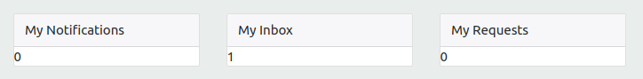
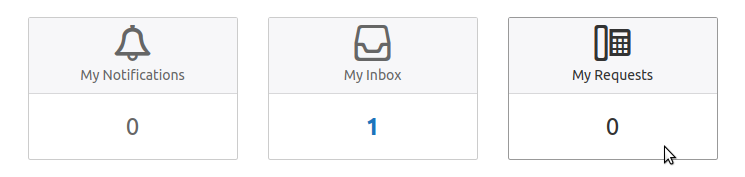
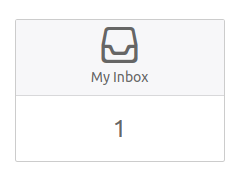
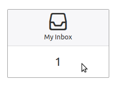
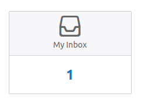

# 10. Highlights

We are now ready to fill in the remaining details of the design.

## What we want to achieve

For the cards, we will implement the following requirements:

* Center the text in the cards
* A large icon should be displayed in the card header
* The cards should link to the appropriate page in Self Service
* The card should 'light up' when you hover the mouse over it
* The counter in the card body should be highlighted in blue when it is larger than 0

This will transform the cards from this:



to this:



## Initial style

First add the following CSS to the Homepage CSS field:

``` css
.card {
  color: #666;
  border-color: #ccc;

  .card-header {
    font-size: 14px;
    
    .ii { 
      font-size: 36px; 
    }
  }
  
  .card-body {
    font-size: 24px;
    margin: 16px;
  }
}
```

## Centering the text

We will start by centering the text in the cards.

**Exercise**

Center all the text in all of the cards (horizontally). 
Use one of the utility classes of https://getbootstrap.com/docs/4.1/utilities/ to achieve this.

**Solution**

Add the `text-center` class to the row containing the cards:

``` html
<div class="row justify-content-center text-center">
  ...
</div>
```

## Adding the icons

Throughout the 4me application, an *icon font* is used to display icons. 
An icon font is just like a regular font (such as Arial or Times New Roman), only it contains icons instead of letters.

Icon fonts have several advantages over using images, some of which are:

* The icons in an icon font look nice and sharp, regardless of their size
* You can change their color and other attributes using CSS (no need for a different image per color)

If you open the dropdown menu in Self Service, you can see several examples of these icons in front of each menu item.
Use the Element Inspector of the Developer Tools to inspect the icon in front of the "My Inbox" menu item.

The HTML looks like this:

``` html
<i class="ii icon-inbox"></i>
```

The relevant parts of the CSS look like this:

``` css
.ii {
  font: normal normal 14px itrp-icons; // Use the font 'itrp-icons' and set it to 14px
}

.icon-inbox:before {
  content: "\e300"; // A font is like a long list of characters. \e300 means "the e300th character" or, 
                    // in plain English, "the 58112th character".
}
```

The `:before` part of the second rule is called a [pseudo-element](https://developer.mozilla.org/en-US/docs/Web/CSS/::before). 
It is used to insert some content inside the element with class `icon-inbox`.
In this case, we insert the 58112th character in the itrp-icons font, which happens to look like an inbox.

**Exercise**

Add the proper icons to the header of each of the cards.

**Solution**

This is the result:

``` html
<div class="row justify-content-center text-center">
  <div class="col-sm col-lg-3 mt-5">
    <div class="card">
      <div class="card-header">
        <i class="ii icon-notification"></i>
        <div>My Notifications</div>
      </div>
      <div class="card-body">
        <div>{{my_notifications_count}}</div>
      </div>
    </div>
  </div>
  <div class="col-sm col-lg-3 mt-5">
    <div class="card">
      <div class="card-header">
        <i class="ii icon-inbox"></i>
        <div>My Inbox</div>
      </div>
      <div class="card-body">
        <div>{{my_inbox_count}}</div>
      </div>
    </div>
  </div>
  <div class="col-sm col-lg-3 mt-5">
    <div class="card">
      <div class="card-header">
        <i class="ii icon-request"></i>
        <div>My Requests</div>
      </div>
      <div class="card-body">
        <div>{{my_requests_count}}</div>
      </div>
    </div>
  </div>
</div>
```

## Link the cards

**Exercise**

Turn the *entire* card into a link, so that clicking anywhere on the card brings you to the correct self service page.

Make sure that the cards do not 'turn blue'.

**Solution**

Change the card row in the Homepage HTML field to this:

``` html
<div class="row justify-content-center text-center">
  <div class="col-sm col-lg-3 mt-5">
    <a class="card" href="/self-service/notifications">
      <div class="card-header">
        <i class="ii icon-notification"></i>
        <div>My Notifications</div>
      </div>
      <div class="card-body">
        <div>{{my_notifications_count}}</div>
      </div>
    </a>
  </div>
  <div class="col-sm col-lg-3 mt-5">
    <a class="card" href="/self-service/inbox">
      <div class="card-header">
        <i class="ii icon-inbox"></i>
        <div>My Inbox</div>
      </div>
      <div class="card-body">
        <div>{{my_inbox_count}}</div>
      </div>
    </a>
  </div>
  <div class="col-sm col-lg-3 mt-5">
    <a class="card" href="/self-service/requests">
      <div class="card-header">
        <i class="ii icon-request"></i>
        <div>My Requests</div>
      </div>
      <div class="card-body">
        <div>{{my_requests_count}}</div>
      </div>
    </a>
  </div>
</div>
```

To keep the correct colors, we have to be more specific in the CSS: the CSS rule for links is currently more specific
than the rule for `.card` elements. To fix this, adjust the card CSS from this:

``` css
.card {
  ...
}
```

to this:

``` css
a.card {
  ...
}
``` 

## Highlight on hover

Next, we highlight the card when you hover over it with the mouse, like this:





We can make use of the `:hover` [pseudo-selector](https://developer.mozilla.org/en-US/docs/Web/CSS/:hover) to do this.

A pseudo-selector applies only to certain 'states' of a HTML element. You can use it to express things like:

* Change the color of this element when the mouse is hovered over it
* Change the shadow effect when the cursor is in this input field
* Change the background of this button when the mouse is pressed down on it

**Exercise**

When the mouse is hovered over a card, its border should turn to the color `#999` 
and all the text in it (including the icons) should turn `#333`. Implement this by making use of the `:hover` pseudo-selector.

**Solution**

Add the following to the Homepage CSS field:

``` css
a.card:hover {
  color: #333333;
  border-color: #999999;
}
```

Alternatively, you can use some SCSS syntax and write this instead:

``` css
a.card {
  ...
    
  &:hover {
    color: #333333;
    border-color: #999999;
  }
}
```

## Highlight counts higher than 0

Finally, we want to highlight counts higher than 0, by making the number blue and bold:



How could we do this? It seems we have to apply a CSS rule based on the text inside a HTML element:

> If the text is *not* 0, make it blue and bold 

Unfortunately this is not possible with CSS, so we will have to try something else. 
Could we somehow encode the necessary information in the class attribute?

This is indeed possible: the *text* inside the element is rendered with a widget, and we can do the same
with the class attribute:

``` html
<div class="card-body count-{{my_inbox_count}}">
  <div>{{my_inbox_count}}</div>
</div>
```

**Exercise**

Apply the technique outlined above to style the counters:

* If the class is count-0, the text should be the normal color and normal font size
* Otherwise, the text should be blue (`#1b75bc`) and bold (use the `font-weight` CSS property for this)

**Solution**

The cards HTML will become like this:

``` html
<div class="row justify-content-center text-center">
  <div class="col-sm col-lg-3 mt-5">
    <a class="card" href="/self-service/notifications">
      <div class="card-header">
        <i class="ii icon-notification"></i>
        <div>My Notifications</div>
      </div>
      <div class="card-body count-{{my_notifications_count}}">
        <div>{{my_notifications_count}}</div>
      </div>
    </a>
  </div>
  <div class="col-sm col-lg-3 mt-5">
    <a class="card" href="/self-service/inbox">
      <div class="card-header">
        <i class="ii icon-inbox"></i>
        <div>My Inbox</div>
      </div>
      <div class="card-body count-{{my_inbox_count}}">
        <div>{{my_inbox_count}}</div>
      </div>
    </a>
  </div>
  <div class="col-sm col-lg-3 mt-5">
    <a class="card" href="/self-service/requests">
      <div class="card-header">
        <i class="ii icon-request"></i>
        <div>My Requests</div>
      </div>
      <div class="card-body count-{{my_requests_count}}">
        <div>{{my_requests_count}}</div>
      </div>
    </a>
  </div>
</div>
```

The following CSS rule accomplishes the desired effect:

``` css
a.card .card-body:not(.count-0) {
  color: #1c74bc;
  font-weight: bold;
}
```

[Continue to the final step](11-finishing-touches.md).
