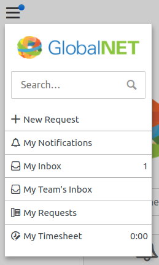
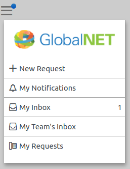
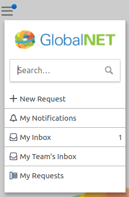

# 11. Finishing touches

In this final step we will deal with the global navigation menu.

## What we want to achieve

We removed the search and time spent icons from the navigation bar, but we still want these to be accessible
via the dropdown menu.

We will make it look like this:



## Styling the search bar

The big search bar on the homepage and the little one in the dropdown menu have exactly the same styling.
Therefore, the CSS to style it should be added to the `CSS` field of the Self Service Design: 

``` css
.widget-search {
  .search-component {
    .search-container {
      .search-phrases {
        background: white;
        padding: 0;
      }

      .search-fields {
        height: inherit;
      }

      .search-q {
        height: inherit;
        padding-left: 1.5rem;
        border-radius: 2px;
        border-color: #ccc;
        &:focus {
        	box-shadow: 0 2px 2px 0 rgba(0,0,0,0.16);
        }
      }
    }

    .search-btn {
      height: inherit;
      top: 0;
      right: 0;
      width: 4.5rem;
      display: flex;
      align-items: center;
      justify-content: center;
    }

    &:not(.with-inactive-search-btn) {
      .search-btn {
        background: #999999;
        color: white;
        border-color: transparent;

        &:hover {
          background: #333333;
        }
      }
    }
  }
}
```

## Customizing the global navigation menu

**Exercise**

The `Global navigation HTML` field of the Self Service Design uses the `{{brand}}` widget to render a link to the homepage with the account name.

Can you replace this with a logo that links to the homepage instead? The result should look similar to this:



**Solution**  

Replace the `{{brand}}` widget with the following HTML:

``` html
<div class="logo">
  <a href="/self-service">
    
  </a>
</div>
``` 

In the `CSS` field, add the following CSS:

``` css
.global-navigation {
  .logo {
    margin: 20px;
  }
  
  img {
    width: 100%;
  }
}
```

**Exercise**

Add the search bar to the global navigation menu, so that it looks like this:



**Solution**

Add the following `{{search}}` widget to the `Global navigation HTML` field, so that it looks like this:

``` html
<div class="logo">
  <a href="/self-service">
    
  </a>
</div>
{{search placeholder="Search…"}}
{{navigation_menu}}
```

In the `CSS` field, change the `.global-navigation` rule to:

``` css
.global-navigation {
  .logo {
    margin: 20px;
  }
  
  img {
    width: 100%;
  }
  
  .widget-search {
    margin: 0 10px; // abbreviation of "0 margin on top and bottom, 10px margin on left and right".
  }
}
```

**Exercise**

The 'My Timesheet' link in the navigation menu is by default hidden on larger screens.
We want to always display it, no matter the screen size. Can you make this change?

**Solution**

Add the following to the `CSS` field:

``` css
#menu-timesheet {
  display: block !important;
}
```

## The final result

Congratulations, you finished the Self Service Design for GlobalNet!

The design should now look very similar to the screenshots we showed at [the beginning](1-introduction.md).
 
