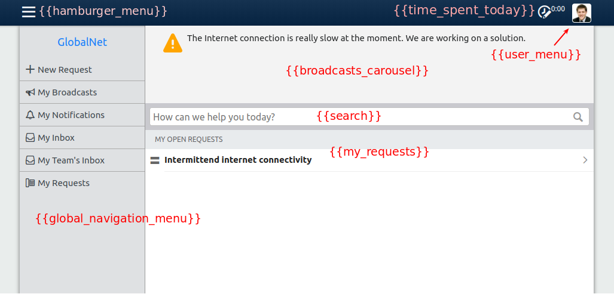

# 2. Structure of the Self Service portal

Before we dive in, let us first get familiar with how the 4me Self Service portal is structured.   

Log in to [https://globalnet.4me-demo.com](https://globalnet.4me-demo.com) as chuck.v@ios.com.
(The password of all users in the demo environment is `4me`.)

You are now on the Self Service homepage.

Open the hamburger menu and click on My Requests. 
A list of the requests submitted by Chuck Vaughn appears (in this case, there is only one).

Now click on New Request. A simple form appears. 

This is Self Service as it looks out of the box, without any customization. 
It is intentionally kept very basic, as we expect that most customers will want to adjust the design to the look and feel of their own company.

For the purposes of design, the pages on Self Service can be divided in two groups:

* The homepage
* All the other pages, such as the My Requests page and the pages of the New Request wizard 

The homepage can be fully customized. You can replace both the HTML and CSS with your own.

On the other pages you can also fully customize the CSS, but you cannot change the HTML.

# Self Service Design form

Let us see how this is accomplished.

In another browser, log in to https://globalnet.4me-demo.com as frederic.anderson@globalnet.com.
and go to https://globalnet.4me-demo.com/account/self_service_design.

On this page, you can see 4 fields:

* CSS
* Homepage HTML
* Homepage CSS
* Global Navigation HTML

Together, these 4 fields can be used to customize both the homepage and the other pages of Self Service. They work together as described below.

## Homepage

### HTML

The HTML of the Self Service homepage is built up as follows:

``` html
<html>
  <head>
    Inserted by 4me
  </head>
  <body>
    Value of the Homepage HTML field
  </body>
</html>
```

That means that, apart from the `<head>` part of the HTML (which is not shown by the browser, but contains information about the page),
you can create any HTML you like.   

It is possible to include _widgets_ on the homepage by adding `{{name of the widget}}` at the desired location in the Homepage HTML. 
Widgets are standard components offered by 4me that can be used to display dynamic content 
(e.g., content that depends on the currently logged in user).

When a user visits Self Service, the widgets will be replaced by HTML.

`{{brand}}` is an example of a widget. For GlobalNet, this widget renders the following HTML:

``` html
<div class="widget-brand">
  <a class="brand" href="/self-service">GlobalNet</a>
</div>
```

When you put the cursor in the Homepage HTML field and type `{{`, a list of available widgets appears.

The out-of-the-box design contains the following widgets:



### CSS

The CSS of the homepage is built up as follows:

1. CSS of [Bootstrap](https://getbootstrap.com/) (more on that later)
2. Standard 4me CSS, used to style standard widgets that may occur **on the homepage**, such as the search bar and the user menu.
3. CSS of the `CSS` field of the Self Service Design
4. CSS of the `Homepage CSS` field of the Self Service Design

## Other Self Service pages 

### HTML

It is not possible to customize the HTML of the other Self Service pages, with the exception of the global navigation menu.
This is the menu that is displayed when you click on the hamburger menu icon in the top left corner. 
By default, it contains only the following widgets:

* `{{brand}}`: the Account name, linking to the Self Service homepage
* `{{navigation_menu}}`: a list of links to all the pages of Self Service

You can adjust the `Global Navigation HTML` field of the Self Service Design to also include other elements, 
such as custom links.

The global navigation menu can also be included on the homepage. 
If you add the `{{global_navigation_menu}}` widget to the `Homepage HTML` field, 
the HTML of the `Global Navigation HTML` field is inserted at the appropriate location.

### CSS

The CSS of the other Self Service pages is built up as follows:

1. CSS of [Bootstrap](https://getbootstrap.com/)
2. Standard 4me CSS
3. CSS of the `CSS` field of the Self Service Design

As you can see, the `CSS` field of the Self Service Design is injected both on the homepage and on all the other pages.
You should use it to customize components that occur on both, such as the navigation bar.

## Mobile devices and responsive design

When you log in using a mobile device, the *same* Self Service Design is shown as on a desktop. 
That means you have to make sure that the same design looks good both on desktop and on mobile devices. 

You can do this by using a technique called *responsive design*. 
The word *responsive* refers to the fact that the design 'responds' to different screen sizes,
for example by displaying content in a row on a large screen and in a column on a small screen.
  
We will work through some examples later.

[Continue to the next step](3-bootstrap.md).
