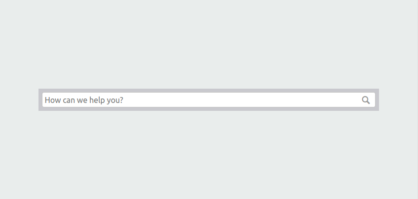

# 4. First steps: The search bar

Enough theory, let's get started!

We will start with a clean slate and build the design from the ground up.

## What we want to achieve

The first step will be to insert the search bar in the middle of the page, like this:



We would like the search bar to be both horizontally and vertically centered.

Its size should depend on the size of the browser window, and be neither too big nor too small.
On a large desktop screen, it should not be too big and have quite some space on the left and right.
On a mobile device, the search bar should be the entire width of the screen.

Bootstrap can help us with this.

## A horizontally centered search bar

Log in to https://globalnet.4me-demo.com as frederic.anderson@globalnet.com
and go to the Self Service Design. Clear out the `Homepage HTML` field and replace it with a single `div`:

``` html
<div>
</div>
```

Save the result. 

In another browser (window), 
go to https://globalnet.4me-demo.com/self-service and you will be greeted with a blank page...

**Exercise 4.1**

By using a Bootstrap container and a row consisting of a single column, 
can you add the `{{search}}` widget, so that it is horizontally centered at the top of the page?


Use the resources [here](https://getbootstrap.com/docs/4.1/layout/overview/) 
and [here](https://getbootstrap.com/docs/4.1/layout/grid/) for inspiration.


[**View answer**](answers/answer-4.1.md)


## Vertical centering

Vertical centering means that the space above and below the content is exactly the same.

We can achieve this using Bootstrap, by wrapping the row in another column and applying the appropriate alignment
(https://getbootstrap.com/docs/4.1/layout/grid/#vertical-alignment):

``` html
<div class="container">
  <div class="row no-gutters align-items-center main-content">
    <div class="col">
      <div class="row">
        <div class="col">
          {{search}}
        </div>
      </div>
    </div>
  </div>
</div>
```

Change the Homepage HTML field so that it contains the content above and save the design. 

### Height

If you view the results at https://globalnet.4me-demo.com/self-service, you will not see any difference yet.

We also need to make the `.main-content` equal to the height of the browser window (also known as the *viewport*).
As you'd expect, you can use the `height` CSS property to do so. But which value should this property get?

**Exercise 4.2**

Take a moment to look at the units listed at https://www.w3schools.com/cssref/css_units.asp 
and decide which value would be appropriate.
 
Add the appropriate CSS rule to the `Homepage CSS` field of the Self Service Design. 

[**View answer**](answers/answer-4.2.md)


## Placeholder

The search bar is blank by default, but you can add a *placeholder* text to it that is displayed 
when the user has not entered any text yet. 

Add it to the search widget as follows:

``` html
<div class="container">
  <div class="row no-gutters align-items-center main-content">
    <div class="col">
      <div class="row">
        <div class="col">
          {{search placeholder="How can we help you?"}}
        </div>
      </div>
    </div>
  </div>
</div>
```

Save the design and check the results in the Self Service portal.
It should now look like the screenshot at the top of this page.

[Continue to the next chapter](5-logo.md).
