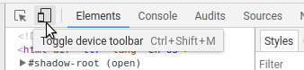

# 6. Media queries

We have already centered the logo and search bar.

Let's see what it looks like on mobile.

In Chrome, go to https://globalnet.4me-demo.com/self-service.

Open the Developer Tools by pressing Ctrl+Shift+I on Windows, or Command+Option+I on Mac.

> Note: most modern browsers include developer tools. 
As the name indicates, they are very useful for developers of websites and web applications.
Among (many) other things, they allow you to look at the HTML and CSS of a web page and make real time adjustments. 
This is ideal for trying out ideas or debugging a layout. It is also very useful to 'borrow' ideas from other websites...

In the corner is an icon for opening the Device Toolbar, which can be used to simulate various mobile devices:



Click on it and choose a mobile device such as 'iPhone X'. 
You'll see that the viewport resizes to be the same width and height as the iPhone X.

As you can see, thanks to Bootstrap the logo and search bar fit nicely within the viewport.

However, the vertical centering looks a bit odd on a mobile device.
It would be nicer it this happened *only* on larger screens.
On a mobile device, the logo and searchbar should be at the top of the screen

## Distinguishing between mobile and desktop

To distinguish between mobile and desktop, 
we can make use of [media queries](https://developer.mozilla.org/en-US/docs/Web/CSS/Media_Queries/Using_media_queries)
in CSS. 

A media query allows you to express things like:

* apply this CSS only when the screen is wider than 768px
* apply this CSS only on devices on which "hovering" over an element makes sense
* apply this CSS only when printing the page

**Exercise**

Using a media query and referring to https://developer.mozilla.org/en-US/docs/Web/CSS/Media_Queries/Using_media_queries,
can you express the following?

> Apply the CSS ruleset for the height of `.main-content` only when the screen is at least 568px.

**Solution**

Enclose the `.main-content` ruleset in a media query like this:

``` css
@media (min-width: 568px) {
  .main-content {
    ...
  }
}
```

[Continue to the next step](7-cards.md).
