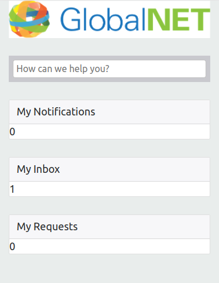

# 7. Cards

The final part of the main content are the three boxes below the search bar.
We will add them next.

## What we want to achieve

What we want to achieve in this step is this.

* On a small or medium screen, the three boxes should be as wide as the search bar:


* On a large screen, the three boxes should be a little smaller than the search bar, like this:


* On a very small screen, the three boxes should be stacked on top of each other:



## Adding the boxes

We first take care of the first requirement.

We will use the [card](https://getbootstrap.com/docs/4.1/components/card/) component for the boxes.
Add the following HTML to the design, so that each card gets its own column:


``` html
<div class="row">
  <div class="col">
    <div class="card">
      <div class="card-header">
        <div>My Notifications</div>
      </div>
      <div class="card-body">
        <div>{{my_notifications_count}}</div>
      </div>
    </div>
  </div>
  <div class="col">
    <div class="card">
      <div class="card-header">
        <div>My Inbox</div>
      </div>
      <div class="card-body">
        <div>{{my_inbox_count}}</div>
      </div>
    </div>
  </div>
  <div class="col">
    <div class="card">
      <div class="card-header">
        <div>My Requests</div>
      </div>
      <div class="card-body">
        <div>{{my_requests_count}}</div>
      </div>
    </div>
  </div>
</div>
```

Check out the result.

## The second requirement

Let us turn to the second requirement now.

For now, do not worry about the distinction between different screen sizes. 
We will first focus on making the boxes a little less wide than the search bar.

**Exercise**

Take a look at the diagram in https://getbootstrap.com/docs/4.1/layout/grid/#horizontal-alignment.
Taking inspiration from that diagram and the HTML below it, can you implement the requirement?

Hint: the '4' in `col-4` means "This column should be 4 out of 12 units wide".

**Solution**

``` html
<div class="row justify-content-center">
  <div class="col-3">
    <div class="card">
      ...
    </div>
  </div>
  <div class="col-3">
    <div class="card">
      ...
    </div>
  </div>
  <div class="col-3">
    <div class="card">
      ...
    </div>
  </div>
</div>
```

## Putting it together

When we introduced Bootstrap (link), we showed a row with three `col-sm` columns. 
This had the effect that the three columns become stacked on very small screens.

This is also what we want for our cards, so it looks we have to use it. 

But can we implement all of these requirements at the same time?

* Stacked on very small screens
* Three columns taking up 100% width on small and medium screens
* Three columns centered and about 75% width on large screens

The answer is: yes! Take a look at https://getbootstrap.com/docs/4.1/layout/grid/#mix-and-match to see some of the things you can do.

**Exercise** 

Implement all three requirements.

**Solution**

``` html
<div class="row justify-content-center">
  <div class="col-sm col-lg-3">
    <div class="card">
      ...
    </div>
  </div>
  <div class="col-sm col-lg-3">
    <div class="card">
      ...
    </div>
  </div>
  <div class="col-sm col-lg-3">
    <div class="card">
      ...
    </div>
  </div>
</div>
```

## Give it some space

**Exercise**

The elements in the center of the page are currently 'stuck' together, with no vertical whitespace between them.

It would be nice to add some margin to the top of the search bar and to the top of each card. 

Use the explanation at https://getbootstrap.com/docs/4.1/utilities/spacing/ to add this margin.

**Solution**

The maximum margin size of 5 looks good, because it makes the whitespace between the cards the same as that between
the searchbar and the cards. The result is as follows:

``` html
<div class="row">
  <div class="col mt-5">
    {{search}}
  </div>
</div>

<div class="row justify-content-center">
  <div class="col-sm col-lg-3 mt-5">
    <div class="card">
      ...
    </div>
  </div>
  <div class="col-sm col-lg-3 mt-5">
    <div class="card">
      ...
    </div>
  </div>
  <div class="col-sm col-lg-3 mt-5">
    <div class="card">
      ...
    </div>
  </div>
</div>
```

[Continue to the next step](8-navigation-bar.md).
