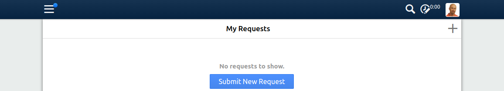
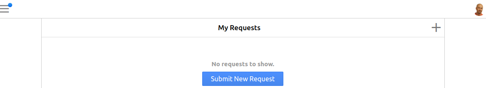
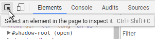
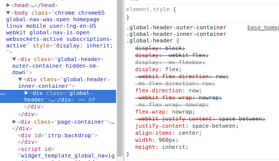
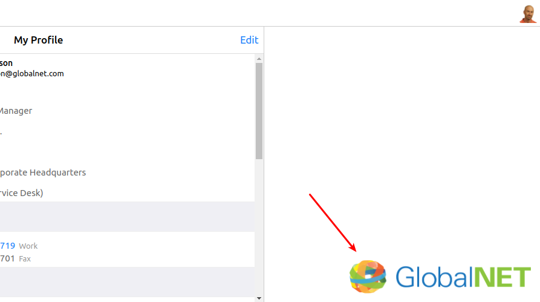

# 8. Navigation bar

The main content does not quite look like our design yet, but we have the basic layout in place now.

Before we continue to fill in the details, let's first switch our attention to a different part of the design: the navigation bar.

## What we want to achieve

The navigation bar and menu occur on each Self Service page.

By default the navigation bar looks like this:



We want to transform it to:



We will work on the following requirements:

* Show only the hamburger menu and the user menu, not the Search and Time spent today icons
* The hamburger menu should be all the way to the left, and the user menu all the way to the right
* The user avatar should be a circle
* The user menu should have a background color that matches the GlobalNet logo
* The hamburger menu should be a drop down menu

## Using the Chrome Developer Tools to experiment

The Developer Tools provided by the browser are very useful to try out modifications to a design, 
because you can immediately see the effect of your changes.
 
You can use the Developer Tools to find out how a piece of HTML is being styled by the browser, 
modify it until you are satisfied with the results, 
and then return to 4me to make the appropriate modifications in your Self Service Design.

Let us do this for some of the requirements above.

In Chrome, log in to GlobalNet as frederic.anderson@globalnet.com and go to https://globalnet.4me-demo.com/self-service/inbox.

Open the developer tools (Ctrl-Shift-I or Cmd+Option+I). Click on the icon for the Element Inspector:



Next, click somewhere in the middle of the navigation bar, so that the HTML element `div.global-header` is selected.

In the Elements panel, the corresponding element should now be selected and you should see which CSS properties apply to it:



Notice that this element is contained within a `div.global-header-inner-container`, 
which is itself contained within a `div.global-header-outer-container`.

**Exercise**

The width of the global header is by default restricted to 960px. 
Using the developer tools, can you remove this restriction and make the global header span the full width of the browser window?

**Solution**

One possibility is to set the `max-width` property of the `.global-header-outer-container .global-header-inner-container` to `100%`
and the `width` property of the `.global-header-outer-container .global-header-inner-container .global-header` to `100%`.

**Exercise**

With the developer tools, you can also define new style rules, using the `+` icon.
Using this, can you hide the search and timesheet icons?

Hint: the `visibility` CSS property can be used for this, see https://developer.mozilla.org/en-US/docs/Web/CSS/visibility.

**Solution**

Add these rules:

``` css
.global_search_link.header-button {
  visibility: hidden;
}

.widget-time-spent-today.header-button {
  visibility: hidden;
}
```

**Exercise**

Still in the developer tools, can you adjust the small avatar, and the larger one that appears when you click on the small avatar, 
so that they are circular rather than rounded rectangles?

Hint: there is no need to define a new CSS property, you can achieve this by adjusting the existing CSS properties.

**Solution**

In these two CSS rules, change the `border-radius` property to `50%`:

``` css
.widget-user-menu .gmenu-toggler .avatar_person
.widget-user-menu li#user-info .avatar_person
```

**Exercise**

Change the background color of the navigation bar to white, 
and replace the shadow at the bottom with a border that is 1px wide and a slightly darker gray (`#ccc`). 
Finally, change the color of the hamburger menu icon to `#888`. 

**Solution**

Select the `.global-header-outer-container` element and set the `background` property to `#fafafa`.
Uncheck the `box-shadow` property.
Add the property `border-bottom: 1px solid #ccc`.

If you select the button with class `hamburger-menu-toggler`, 
you will see a CSS selector `.global-header-outer-container .global-header-inner-container .global-header .header-button`.
In this selector, add the property `color: #888`.

**Exercise**

While we are at it, we might as well adjust the rest of the page to the GlobalNet look and feel.

The page currently has a gray background. Change it to white.

The main content has a shadow effect. Remove that effect and replace it with a 1px `#ccc` border.

**Solution**

Change the `background-color` property of the `body` rule to `white`.

Find the `.page-container`, uncheck the `box-shadow` property and add the following two properties:

``` css
border-left: 1px solid #ccc;
border-right: 1px solid #ccc;
```

**Exercise**

It would be nice to add a small GlobalNet logo at the bottom right corner of the page:



Using one of the examples at https://www.w3schools.com/cssref/pr_background-position.asp,
 position the logo from the Media Library in the appropriate location.
 
Next, change the background size so that the logo is `300px` wide.

Finally, it looks better if the background is not quite pressed against the bottom right corner, but has some whitespace.
Using the `calc()` CSS function explained at https://developer.mozilla.org/en-US/docs/Web/CSS/calc, 
can you adjust the background position so that it is `16px` away from the bottom and `16px` away from the right?

**Solution**

The `body` CSS rule will have the following properties for the background:

``` css
background-color: white;
background-image: url(<url to your media file>);
background-attachment: fixed;
background-repeat: no-repeat;
background-position: calc(100% - 16px) calc(100% - 16px);
background-size: 300px auto;
```

**Exercise**

The user menu is still a dark blue. We would like to change it to the blue color of the GlobalNet logo.
Although we don't know the color, we can use the developer tools to find out.

Using the element inspector, find the element on which the dark blue color (gradient) is defined.
Change the `background` property to `blue`.

You will notice a small blue box next to the color:


Click on this box to open the color picker.

Next, hover the mouse over the final 'l' in the GlobalNet logo. You will see a close up of the individual pixels.
Click on one of the darkest blue pixels. You should see that the color of the user menu changes to that same color.

Click once more on the blue box to close the color picker.

**Solution**

The `background` property should now be set to `#1a74bc` (or a similar shade of blue).         
  

## Save the results

Happy with the results of our experiments, we can now adjust the Self Service Design itself.

Go to the Self Service Design, and add the following to the `CSS` field:

``` css
body {
  background-color: white;
  background-image: url(<url to your media file>);
  background-attachment: fixed;
  background-repeat: no-repeat;
  background-position: calc(100% - 16px) calc(100% - 16px);
  background-size: 300px auto;
}

.global-header-outer-container {
  background: white;
  border-bottom: 1px solid #ccc;
  box-shadow: none;

  .hamburger-menu-toggler {
    color: #888;
  }

  .global-header-inner-container {
    max-width: 100%;

    .global-header {
      width: 100%;
    }
  }

  .widget-user-menu li#user-info {
    background: #1a74bc;
	}
}

.global_search_link.header-button {
  visibility: hidden;
}

.widget-time-spent-today.header-button {
  visibility: hidden;
}

.avatar_person {
  border-radius: 100% !important;
}

.page-container {
  box-shadow: none;
  border-left: 1px solid #ccc;
  border-right: 1px solid #ccc;
}

```

Save the design and check the results in the browser.

## A note on syntax: SCSS

You might notice that some of the rules are nested, like this:

``` css
.global-header-inner-container {
  .global-header {
  }
}
```

This is very useful for showing which rules are grouped together, but it is not proper CSS.
The browser does not understand this, and needs the above rules to be written like this:

``` css
.global-header-outer-container {
  background: white;
  border-bottom: 1px solid #ccc;
  box-shadow: none;
}

.global-header-outer-container .header-button {
  color: #888;
}

.global-header-outer-container .global-header-inner-container {
  max-width: 100%;
}

.global-header-outer-container .global-header-inner-container .global-header {
  width: 100%;
}

.global-header-outer-container .widget-user-menu li#user-info {
  background: #1a74bc;
}
``` 

Because we feel that the latter is much harder to read and write than the former, 
all CSS fields in 4me may contain SCSS, which is a 'dialect' of CSS that adds some useful extensions to the language,
such as nesting and the use of variables (https://sass-lang.com/documentation/file.SASS_REFERENCE.html#css_extensions).

When you use SCSS syntax, it is translated to proper CSS before it is served to the browser.

## Add the navigation bar to the homepage

We want the navigation bar to be visible on the homepage as well. 
Since we started with a blank slate, we'll have to add it ourselves.

Add the following to the top of the Homepage HTML field:

``` html
<section class="header">
  <div class="global-header-outer-container">
    <div class="global-header-inner-container">
      <div class="global-header">
        <div class="left">
          {{hamburger_menu}}
        </div>
        
        <div class="right">
          {{user_menu}}
        </div>
      </div>
    </div>
  </div>
</section>

<nav class="global-navigation menu-slide">
  {{global_navigation_menu}}
</nav>
```

We don't want a border on the header bar, so also add the following to the Homepage CSS field:

``` css
.global-header-outer-container {
  border: none;
}
```

Save and check the homepage.

You will notice a few things that now appear broken. 

First, there is now a small logo in the bottom right corner that we do not want there.
 
In the CSS field, adjust the CSS rule for the `body` selector and tell it that the background image should *not* apply to the homepage:

``` css
body {
  background-color: white;
}

body:not(.homepage) {
  background-image: url(<url to your media file>);
  background-attachment: fixed;
  background-repeat: no-repeat;
  background-position: calc(100% - 16px) calc(100% - 16px);
  background-size: 300px auto;
}

```  

## Centering again

Second, now that we have added the navigation bar, the main content is too high and a scroll bar is visible.

**Exercise**

Recall that we set the height of the main content to `100vh`.
 
Using the techniques learned in this step, 
can you adjust it so that it takes the height of the navigation bar into account?

**Solution**

Adjust the CSS rule for `.main-content` to this:

``` css
@media (min-width: 568px) {
  .main-content {
    height: calc(100vh - 4.5rem);
  }
}
``` 

[Continue to the next step](9-dropdown-menu.md).
